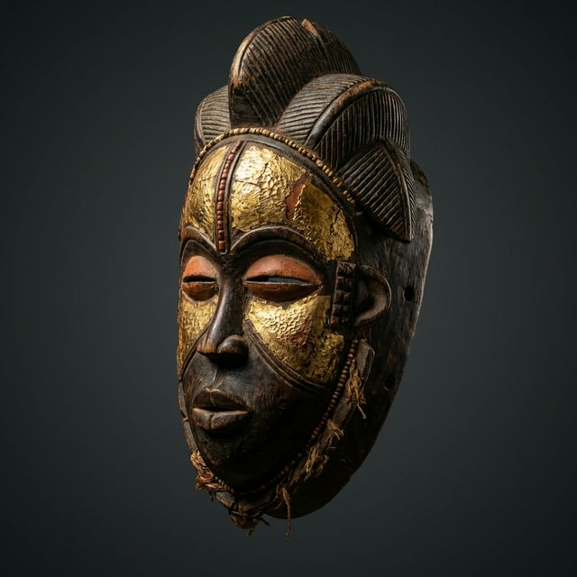

# Earth & Heritage : African Art Gallery
*Projet réalisé par / Project designed and developed by **Trésor Kaseka***

## Description du Projet (Français)

**Earth & Heritage** est une plateforme e-commerce et une galerie d'art numérique premium dédiée à la mise en valeur, la préservation et l'acquisition d'artefacts et d'objets d'art africains authentiques. 

L'objectif de ce projet est de briser les codes traditionnels du e-commerce pour embrasser une esthétique de galerie d'art : minimaliste, immersive et luxueuse. L'interface met en lumière la richesse culturelle de l'Afrique subsaharienne tout en offrant une expérience utilisateur (UX) de pointe, marquée par des "Effets Wahou".

### Fonctionnalités Clés & Effets Wahou
- **Cinematic Smooth Scrolling** : Défilement fluide et inertiel propulsé par [Lenis] pour une expérience de navigation digne des meilleures agences digitales (Awwwards).
- **Cartographie & Provenance** : Visualisation interactive des origines des œuvres via une frise chronologique liée à une carte stylisée de l'Afrique.
- **Enchères en Direct (Bento Dynamique)** : Tableau de bord asymétrique simulant des enchères en temps réel avec un flux d'activité perpétuel.
- **Micro-Physique Magnétique** : Éléments d'interface (boutons) réactifs avec une physique de ressort (Magnetic UI) pour un feeling haut de gamme au survol.
- **Parallax Scroll-Linked** : Les pièces d'art réagissent au défilement, créant une profondeur cinématique.

### Stack Technique Principale
- **Framework** : Next.js 14+ (App Router)
- **Styling** : Tailwind CSS v4 (Design System sur-mesure)
- **Animations** : Framer Motion (useScroll, useSpring)
- **Typographie** : Playfair Display (Titres) & Inter (Corps de texte)

---

## Project Description (English)

**Earth & Heritage** is a premium digital art gallery and e-commerce platform dedicated to showcasing, preserving, and acquiring authentic African artifacts and masterpieces.

The goal of this project is to break away from traditional e-commerce conventions and embrace a pure art gallery aesthetic: minimalist, immersive, and luxurious. The interface highlights the cultural richness of Sub-Saharan Africa while delivering a cutting-edge user experience (UX) defined by signature "Wow Effects".

### Key Features & Wow Effects
- **Cinematic Smooth Scrolling**: Butter-smooth, inertial global scrolling powered by [Lenis] to create a browsing experience worthy of top-tier digital agencies.
- **Cartography & Provenance Timeline**: An interactive visualization tracing artifacts back to their ethnic and geographical origins across a stylized map of Africa.
- **Live Auctions (Dynamic Bento)**: An asymmetrical dashboard simulating real-time exclusive bidding with a perpetual, infinite activity stream.
- **Magnetic Micro-Physics**: Interactive interface elements (like main CTA buttons) programmed with spring physics that magnetically attract to the cursor on hover.
- **Scroll-Linked Parallax**: Artwork pieces react dynamically to scroll progression, giving the page immense cinematic depth.

### Core Tech Stack
- **Framework**: Next.js 14+ (App Router)
- **Styling**: Tailwind CSS v4 (Custom engineered utility design system)
- **Animations**: Framer Motion (useScroll, useSpring)
- **Typography**: Playfair Display (Headings) & Inter (Body)

---

*© 2024-2026 Trésor Kaseka. All Rights Reserved.*
